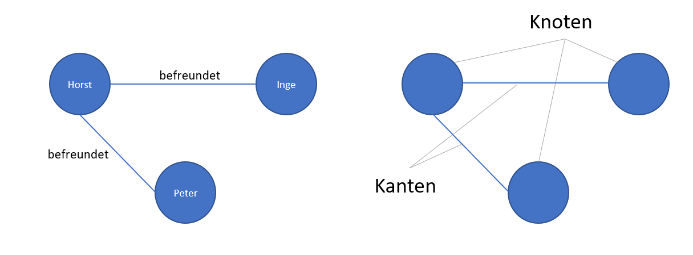
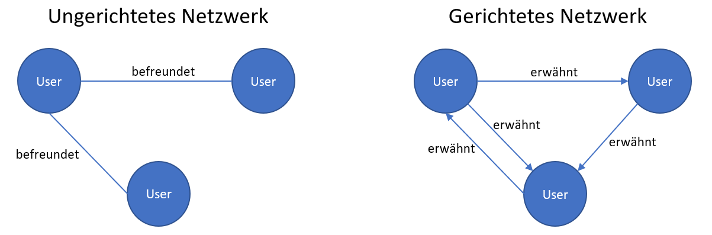
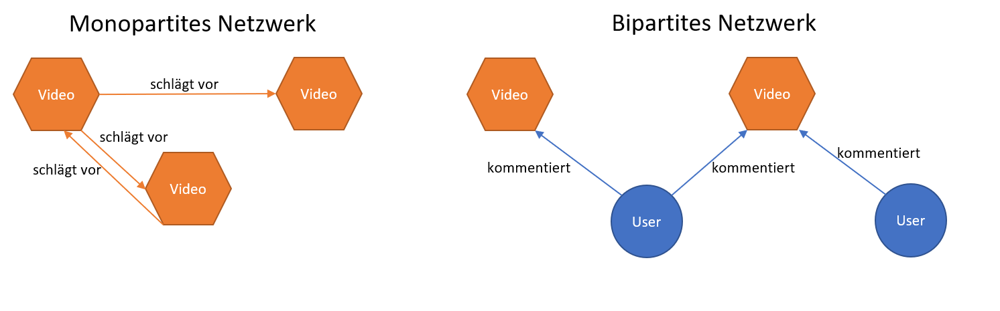
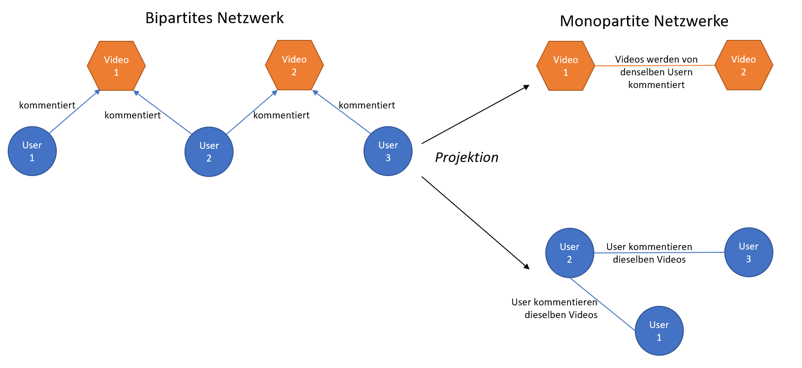

<style>
p.caption {
  font-size: 0.6em;
}
</style>


```{r setup, include=FALSE}
knitr::opts_chunk$set(echo = TRUE,  comment = '', warning = FALSE)
library(tidyverse)
library(vroom)
library(future)
library(furrr)
library(igraph)
library(tidygraph)
library(ggraph)
library(quanteda)
library(quanteda.textstats)
library(quanteda.textplots)
library(spacyr)
library(stm)
library(textgraph)
library(mgcv)

video_comments <- vroom("data/party_comments_january.csv.gz",
                        col_types = list(video_id = "c",
                                         comment_id = "c"))
```


# Netzwerkanalyse

## Netzwerke: Grundlagen

```{r, echo=FALSE, out.height="80%", out.width="80%"}

```

```{r, echo=FALSE, out.height="80%", out.width="80%"}

```


## Netzwerke: mono- und bipartit

```{r, echo=FALSE, out.height="80%", out.width="80%"}

```

```{r, echo=FALSE, out.height="80%", out.width="80%"}

```


## Tools

- Häufig wird die *igraph* Library zur Netzwerkanalyse verwendet. Es gibt sie sowhohl in *R* als auch *Python*
- Alternative: *tidygraph*, eine an das *tidyverse* angegliederte Variante der Netzwerkanalyse
- Größtenteils Wrapper für *igraph*, welche die Manipulation von Netzwerkdaten mit *tidy*/*dplyr*-Syntax erlauben
- Visualisierung von Nertzwerken ist z.B. mit *ggraph* möglich, welches den Syntax von *ggplot2* übernimmt

## Beispieldaten

Kommentare zu von Parteien hochgeladenen Videos auf Youtube vom Januar 2022

```{r, eval = F}
video_comments <- vroom("data/party_comments_january.csv.gz",
                        col_types = list(video_id = "c",
                                         comment_id = "c"))
```


## Beispieldaten

```{r}
str(video_comments)
```


## *tidygraph*

```{r, eval = F}
library(tidyverse)
library(igraph)
library(tidygraph)
library(ggraph)
```

Bipartiter Graph von User zu VideoID (wer hat was kommentiert?)
```{r}
comments_graph <- video_comments %>% 
  # 3 Kommentare von Usern mit fehlendem Namen werden entfernt:
  filter(!is.na(authorDisplayName)) %>% 
  # nur die Spalten authorDisplayName und Video ID auswählen:
  select(authorDisplayName, video_id) %>% 
  # Umwandlung in einen Netzwerkgraphen:
  as_tbl_graph(directed = TRUE)
```

## *tidygraph*
```{r}
comments_graph
```


## Visualisierung
```{r}
ggraph(comments_graph, 
       layout = "fr") + # Layout wählen
  geom_edge_arc(color = "lightgrey") + # Edges hinzufügen
  geom_node_point() # Nodes hinzufügen
```


## Manipulation des Graph

```{r}
comments_subgraph <- comments_graph %>% 
  # Wir wollen auf den Nodes operieren, daher:
  activate(nodes) %>% 
  # Wir berechnen den degree der Nodes:
  mutate(degree = centrality_degree(mode = "total")) %>% 
  # Wir filtern nach Nodes, die einen Degree von mind. 3 haben:
  filter(degree >= 3)
```


## Vergleich mit igraph

```{r}
graph <- video_comments %>% 
  filter(!is.na(authorDisplayName)) %>% 
  select(authorDisplayName, video_id) %>% 
  graph_from_data_frame()

# Berechnung des Degree  
V(graph)$degree <- degree(graph, mode = "all")

# Filtern von Nodes mit Degree >= 3
subgraph <- induced_subgraph(graph,
                             vids = V(graph)[V(graph)$degree >= 3])

```


## Visualisierung II

```{r, eval = F}
# Hinzufüges des Attributs "type", 
#   welches zwischen Usern und Videos unterscheidet
comments_subgraph <- comments_subgraph %>% 
  activate(nodes) %>%
  mutate(type = case_when((name %in%
                             video_comments$video_id) ~ "video",
                          (name %in%
                             video_comments$authorDisplayName) ~ "user"
  ))

ggraph(comments_subgraph, layout = "fr") +
  geom_edge_arc(color = "lightgrey") +
  geom_node_point(aes(color = type, # Typ als Farbe
                      size = degree)) + # degree als Größe
  theme_graph() # Ändern des Designs

```


## Visualisierung II

```{r, echo = F, warnings = F}
# Hinzufüges des Attributs "type", welches zwischen Usern und Videos unterscheidet
comments_subgraph <- comments_subgraph %>% 
  activate(nodes) %>% 
  mutate(type = case_when((name %in% video_comments$video_id) ~ "video",
                          (name %in% video_comments$authorDisplayName) ~ "user"))

ggraph(comments_subgraph, layout = "fr") +
  geom_edge_arc(color = "lightgrey") +
  geom_node_point(aes(color = type, # Typ als Farbe
                      size = degree)) + # degree als Größe
  theme_graph() # Ändern des Designs

```


## Dynamische Netzwerke

```{r}
dynamic_data <- video_comments %>% 
  # 3 Kommentare von Usern mit fehlendem Namen werden entfernt:
  filter(!is.na(authorDisplayName)) %>% 
  # Hinzufügen eines Indikator für die Woche
  mutate(week = floor_date(video_PublishedAt, unit = "week"))
           
```

```{r}

graph_1 <- dynamic_data %>% 
  filter(week == ymd("2022-01-02")) %>% 
  select(authorDisplayName, video_id) %>% 
  as_tbl_graph(directed = TRUE)

# ... und so weiter
```

**Problem:** langsam, viele einzelne Objekte


## Dynamische Netzwerke

**Lösung:** `map()` (parallelisierbar mit `future_map()`)

```{r}
dynamic_graphs <- dynamic_data %>% 
  # Daten nach "week" in einzelne Dataframes aufteilen:
  group_by(week) %>% 
  group_split() %>% 
  # map nutzen, um über alle Dataframes zu operieren
  map(\(data) # "data" als platzhalter für den jeweiligen dataframe
      {
        data %>%
          select(authorDisplayName, video_id) %>%
          # Umwandlung in einen Netzwerkgraphen:
          as_tbl_graph(directed = TRUE) %>%
          # manipulieren des Graphs:
          activate(nodes) %>%
          mutate(degree = centrality_degree(mode = "total")) %>%
          mutate(type = case_when(
            (name %in%
               video_comments$video_id) ~ "video",
            (name %in%
               video_comments$authorDisplayName) ~ "user"
          ))})
```

*Ergebnis:* eine Liste mit Graphen für jede Woche


## Dynamische Netzwerke

```{r}
ggraph(dynamic_graphs[[1]], # anwählen des 1. Graphen in der Liste
       layout = "fr") +
  geom_edge_arc(color = "lightgrey") +
  geom_node_point(aes(color = type, size = degree)) + 
  theme_graph() 
```

## Dynamische Netzwerke

Berechnung der Edge Density für jede Woche

```{r}
dynamic_graphs %>% map(\(graph) graph %>% edge_density)
```


# Quantitative Textanalyse

# Quanteda

## Quanteda

- Framework zur quantitativen Textanalyse
- konsistente Handhabung von unterschiedlichen Datentypen wie Corpus, DFM, etc.
- schnell, da nativ parallelisiert
- erweiterte Funktionalitäten mit den Zusatzpaketen `quanteda.textstats` (Statistiken), `quanteda.textplots` (Visualisierung) und `quanteda.textmodels` (Textscaling & Classifier)
- nicht Teil des *tidyverse*, Syntax und Datentypen weichen ab
- Intro: https://quanteda.io/articles/quickstart.html

## Quanteda
```{r}
corpus <- corpus(video_comments %>%  
                   # fehlende Kommentare entfernen:
                   filter(!is.na(comment_id)), 
                 # Dokument ID definieren
                 docid_field = "comment_id",   
                 # Text definieren
                 text_field = "textOriginal")

print(corpus)
```

## Quanteda
```{r}
tokens <- tokens(corpus,            # extract word tokens and remove punctuation
                 what = "word",
                 remove_punct = T)

print(tokens)
```

## Quanteda
```{r}
dfm <- dfm(tokens,       # construct document-feature-matrix, all words to lower casing
           tolower = T) %>% 
  dfm_remove(stopwords("german")) %>%  # remove german stopwords
  dfm_wordstem(language = "de")        # stem the words

print(dfm)
```


## Top Tokens nach Partei

```{r}
dfm %>% textstat_frequency(groups = party_label) %>%
  group_by(group) %>% slice_max(docfreq, n = 2) %>% 
  select(!rank)   
```
## Keywords in Context

Kontext für das Keyword "Deutschland", nach Partei
```{r}
kwic_de <- tokens %>% tokens_group(party_label) %>% kwic("deutschland")
kwic_de %>% 
  group_by(docname) %>% 
  slice_sample(n = 2) %>% 
  select(docname, pre, keyword, post)
```


## Keyness

```{r}
dfm %>% dfm_group(party_label) %>% 
  textstat_keyness(target = "CDU") %>% 
  textplot_keyness()
```

# SpaCy

## spacyr

- Implementation des spaCy-Algorithmus in R (https://spacy.io/)
- Python Wrapper
- *spaCy* bietet vortrainierte Language Models für unterschiedliche Tasks
- gut für: parsing, lemmatization, Identifikation grammatikalischer Strukturen, Named Entity Recognition
- Integration mit Quanteda


## spacyr: Installation

Da es sich um einen *Python*-Wrapper handelt, benötigt *spacyr* eine *Python3*-Installation. *Diese ist auf dem Server vorhanden.* `spacy_install()` setzt eigenständig die benötigte *Python*-Umgebung auf. Da der Server Python 3.8 installiert hat, kann es sinnvoll sein, die zu installierende spaCy Version festzulegen, um Abhängigkeiten von späteren Python-Versionen zu vermeiden.

```{r, eval = F}
library(spacyr)

spacy_install(version = "3.7.0")
```


## spacyr: Modelle

*spaCy* bietet unterschiedliche Modelle, welche jedoch erst heruntergeladen werden müssen. Eine Übersicht der Modelle findet sich hier: https://spacy.io/usage/models

```{r, eval = F}
spacy_download_langmodel("de_core_news_sm")
```

Das gewählte Modell muss initialisiert werden, um es zu nutzen. `spacy_initialize()` startet den benötigten *Python*-Prozess im Hintergrund.

```{r, eval = F}
spacy_initialize(model = "de_core_news_sm")
```

Nach der Verwendung sollte der *Python*-Prozess mit `spacy_finalize()` beendet werden:

```{r, eval = F}
spacy_finalize()
```


## spacyr: Verwendung

Kernfunktion von *spacyr*  ist `spacy_parse()`, welche mittels dem initialisierten Modell Text tokenisiert und Tokens klassifiziert. Darauf aufbauend bietet es unterschiedliche Funktionen:

- Named Entity Recognition mit `entity_extract()`
- Noun Phrase Recognition mit `nounphrase_extract()`
- Zusammenfügen häufig verwendeter Tokens zu einem Wort (z.B. Donald_Trump) mit `entity_consolidate()`
- Filterung nach unterschiedlichen Worttypen wie Zahlen oder Nomen

Für Beispiele siehe: https://spacyr.quanteda.io/articles/using_spacyr.html

# Structural Topic Modeling

## STM

- *R* Package *stm*
- Variante des Topic Modelling, basierend auf LDA
- Probabilistischer Prozess zur Zuordnung von Dokumenten und Wörtern zu latenten Themen, deren Anzahl im Voraus festgelegt werden muss
- erlaubt die Integration von zusätzlichen Variablen, etwa dem Veröffentlichungszeitpunkt eines Dokuments, und die Berechnung ihrer Effekte auf die Topic Prävalenz
- bietet zahlreiche Zusatzfunktionen für Diagnostik, Auswahl der Anzahl an Themen und Interpretation sowie Integration mit *Quanteda*
- https://www.structuraltopicmodel.com/

## STM: Anzahl Themen setzen
```{r}
out <- convert(dfm, to = "stm")
```

```{r, eval = F}
Ks_prevalence <- searchK(documents = out$documents, vocab = out$vocab, 
                         # für jedes K wird ein eigenes Modell berechnet
                         K = c(5:100),
                         prevalence = ~party, data = out$meta,               
                         gamma.prior = "L1", init.type = "Spectral")
```

```{r, echo = F}
Ks_prevalence <- readRDS("stm_results/K_tests.RDS")
```


## STM: Anzahl Themen setzen
```{r, eval = T}
plot.searchK(Ks_prevalence)
```

## STM: Anzahl Themen setzen

Faustregeln:

- Held-Out Likelihod und Semantische Koherenz maximieren
- Residuen minimieren
- Exclusivity beschreibt die Abgrenzbarkeit zwischen einzelnen Themen und sollte ggf. ebenfalls möglichst hoch sein
- häufiger Trade-Off zwischen semantischer Koherenz und Exklusivität
- Unterschiedliche Vorgehensweisen, z.B. Suche nach Plateaus - aber: abhängig von Textsorte und Anwendungsgebiet
- Evaluation sollte nicht nur statistisch, sondern auch im qualitativen Vergleich unterschiedlicher Modelle erfolgen

**Siehe auch:** Maier et al. 2018. Applying LDA Topic Modeling in Communication Research. https://doi.org/10.1080/19312458.2018.1430754.


## STM: Anzahl Themen setzen

```{r, echo = F}
ggplot(Ks_prevalence$results %>% filter(K <= 20)) +
  geom_point(aes(x=as.double(exclus), y = as.double(semcoh), 
                 color = as.character(K))) +
    labs(x = "Exclusivity", y = "Semantic Coherence", color = "K")
```


## Modell berechnen

```{r, eval = F}
stm <- stm(documents = out$documents, vocab = out$vocab,
            K = 6,
            prevalence = ~party, data = out$meta,               
            gamma.prior = "L1", init.type = "Spectral")

```

```{r, echo = F}
stm <- readRDS("stm_results/stm_k6.RDS")
```


```{r}
summary(stm)
```

## Modell evaluieren

```{r}
findThoughts(stm,
             texts = out$meta$textDisplay,
             n = 3)
```

## Effekte der Metavariable Partei auf Themenprävalenz

```{r}
effects <- estimateEffect(~party, stmobj = stm, metadata = out$meta)

summary(effects)
```


## Weitere Evaluationen: *stminsights*

- das Package *stminsights* bietet weitere Funktionalitäten zur Evaluation und Exploration von STM-Modellen
- graphische Oberfläche
- Berechnung und Plotting von Effektstärken etc.
- https://cschwem2er.github.io/stminsights/index.html


# Textgraph

## *textgraph* Package

- Package zur quantitativen Textanalyse mittels Textkookkurrenznetzwerken
- Ähnlichkeit von Tokens/Worten und ihre Zusammenfassung in Themen wird über ihr gemeinsames Auftreten in Dokumenten berechnet
- Zwei Workflows: a) Finden von Dokumenten auf Grundlage von Seed Terms via Random Walks, vergleichbar mit Seeded Topic Models; b) Finden von Themenclustern mittels Community Detection Algorithmen, vergleichbar mit Unsupervised Topic Modelling
- bietet Funktionalität zur Identifikation von Themenclustern in dynamischen Netzwerken
- mit *future*-Framework parallelisiert
- Teil meines PhDs; https://github.com/TimBMK/textgraph


## *textgraph*

*textgraph* ist derzeit nicht auf *Cran*, daher ist eine Installation von Github nötig

```{r, eval=F}
remotes::install_github("TimBMK/textgraph", build_vignettes = TRUE)

library(textgraph)
```

*textgraph* bietet einen Testdatensatz mit 10.000 Tweets deutscher Politiker:innen und Institutionen, welcher mittels `data()` geladen werden kann

```{r}
data("de_pol_twitter")
```


## *textgraph*: Seed Terms

Hier: Terme, welche von den Ministerien besonders häufig verwendet werden, nach Chi²

```{r}
seed_terms <- get_seed_terms(de_pol_twitter,
                             doc_id = "doc_id",
                             tokens = "lemma",
                             grouping_var = "ministry_name",
                             measure = "chi2",
                             threshold = 20)

head(seed_terms)
```

## *textgraph*: Data Cleaning

Wir reduzieren die Menge der zu verarbeitenden Daten, indem wir die seltensten 10% der Terme wegfallen lassen. In aller Regel sind diese für den weiteren Prozess nicht relevant, da es sich um sehr wenig genutzte Begriffe handelt. Hier fallen Begriffe weg, die nur ein einziges Mal vorkommen. Dadurch wird die Menge zu verarbeitender Begriffe jedoch um 60% reduziert!

```{r}
de_pol_twitter_reduced <- drop_quantile(data = de_pol_twitter,
                                        tokens = "lemma",
                                        quantile = 0.1,
                                        ignore_case = FALSE, 
                                        group = "tag",
                                        verbose = TRUE)
```

## *textgraph*: Random Walks

Der Random Walk-Algorithmus benötigt eine spezifischen Netzwerktyp, ein multiplexes Netzwerk. Bei der Erstellung dieses Netzwerks gibt es verschiedene Optionen. Hier gewichten wir die Kanten nach der Pointwise Mutual Information (PMI) und behalten auch negative Kantengewichte

```{r}
multiplex_text_network <-
  make_multiplex_objects(
    de_pol_twitter_reduced,
    document = "doc_id",
    feature = "lemma",
    pmi_weight = TRUE,
    keep_negative_weights = TRUE
  )
```


## *textgraph*: Random Walks

Die Berechnung der Random Walks in dem Netzwerk unterstützt Parallelisierung mit *future*. Dazu muss nur ein `plan()` angelegt werden:

```{r}
plan(multisession, workers = 6)
```

Random Walks berechnen die relative Nähe eines Knotens zu allen anderen Knoten, indem ein zufälliges "ablaufen" aller Verbindungen simuliert wird. Knoten, welche nah an unseren Ausgangsknoten sind, können als funktional äquivalent angesehen werden. In unserem Fall bedeuetet das, dass Knoten, welche nah an unseren Seed Terms sind, thematisch verwandt sind. 


## *textgraph*: Random Walks

Die Funktion `get_rwr_terms()` bietet zahlreiche Optionen zum Anpassen des Prozesses. In diesem Fall lassen wir uns nur die höchsten 10% der für jeden Seed Term normalisierten Walk Scores ausgeben.

```{r, results='hide'}
rwr_terms <- get_rwr_terms(multiplex_text_network,
                           seeds = seed_terms,
                           seed_var = "feature",
                           group_name = "ministry_name",
                           normalize_score = "seeds",
                           walk_score = 0.9,
                           walk_score_quantile = TRUE,
                           report_quantiles = FALSE,
                           walk_score_measure = "seeds_mean",
                           reduce_to_means = TRUE)
plan(sequential) # multisession beenden
```

## *textgraph*: Dokumentklassifikation

Auf Grundlage der so berechneten Random Walk Terms können wir nun Dokumente klassifizieren. Das heißt, wir suchen nach Dokumenten, welche nicht nur die Seed Terme der Ministerien enthalten, sondern ebenso weitere, diesen ähnliche Terme. Praktisch dient dies bspws. dazu, Expert:innendiskurse zu erweitern.

```{r}
classified_documents <- 
  classify_documents(
    walk_terms = rwr_terms,
    group_name = "ministry_name",
    document_tokens = de_pol_twitter_reduced,
    tokens_var = "lemma",
    doc_id = "doc_id",
    classification_measure = "ScoreNormMean",
    normalize_scores = "group",
    cut_frequent_group_terms = NULL,
    verbose = FALSE)
```


## *textgraph*: Dokumentklassifikation

Nun können wir uns relevante Dokumente ausgeben lassen. Da die vollständigen Dokumente (aus Twitter-AGB-Gründen) nicht im Datensatz sind, "bauen" wir uns den Inhalt unterwegs aus den Lemmas zusammen.

```{r}
docs <- top_group_documents(
  classification_result = classified_documents,
  documents = de_pol_twitter %>%
    dplyr::summarise(content = paste(lemma, collapse = ","),
                     .by = doc_id),
  doc_id = "doc_id",
  group_name = "ministry_name",
  classification_score = "score_norm",
  n = 20,
  with_ties = FALSE,
  mode = "return"
)
```

## *textgraph*: Dokumentklassifikation

```{r}
head(docs)
```


## *textgraph*: weitere Funktionen

Beispiele für die Berechnung von thematischen Clustern, deren Exploration und die Berechnung dynamischer Themencluster finden sich in der *textgraph* Vignette:

```{r, eval = F}
vignette("textgraph")
```


# Regressionsmodelle


## *mgcv*

- *mgcv* ist ein R Package, welches neben linearer Regression zahlreiche weitere Regressionsmodelle implementiert und einen vereinheitlichen Syntax bietet
- Es umfasst Regressionen mit nicht-normalverteilten Grundgesamtheiten sowie Modelle, welche nicht-lineare Parameter unterstützen
- Insb. implementiert es Generalized Additive Models (GAMs), welche beide Eigenschaften vereinen und unter anderem die Abbildung eines nicht-linearen Variablenzusammenhang mittels *Splines* unterstützen


## Lineare Regression

```{r, echo=F}
ggplot(iris, aes(x = Petal.Length, y = Petal.Width)) +
  geom_point() +
  labs(x = "Petal Length",
       y = "Petal Width") +
theme_minimal()
```


## Lineare Regression

```{r}
linear_model <- lm(Petal.Width ~ Petal.Length, data = iris)

summary(linear_model)
```
## Lineare Regression

```{r, eval = F}
library(mgcv)
```


```{r}
linear_model_gam <- gam(Petal.Width ~ Petal.Length, 
                        family = gaussian(),
                        data = iris)
summary(linear_model_gam)
```


```{r, echo=F}
ggplot(iris, aes(x = Petal.Length, y = Petal.Width)) +
  geom_point() +
  geom_smooth(method = "lm", formula = y ~ x, se = TRUE, color = "blue") +
  labs(title = "Linear Regression: Petal.Width ~ Petal.Length",
       x = "Petal Length",
       y = "Petal Width") +
  theme_minimal()
```

## Linear Mixed Models

```{r, echo = F}
ggplot(iris, aes(x = Petal.Length, y = Petal.Width, color = Species)) +
  geom_point() +
  labs(x = "Petal Length",
       y = "Petal Width") +
theme_minimal()
```

## Fixed Effects Linear Model

```{r}
fixed_effects_model <- gam(Petal.Width ~ Petal.Length + Species,
                           family = gaussian(),
                           data = iris)
summary(fixed_effects_model)
```


## Linear Mixed Model

Random Effects sind insbesondere dann sinnvoll, wenn davon auszugehen ist, dass eine Variable aufgrund hierarchischer Strukturen stark mit anderen Variablen korreliert (z.B. wenn Gruppen starke Unterschiede in der Variablenausprägung aufweisen)

```{r}
random_effects_model <- gam(Petal.Width ~ Petal.Length + 
                              s(Species, bs  = "re"),
                            family = gaussian(),
                            data = iris)
summary(random_effects_model)
```


```{r, echo = F}
ggplot(iris, aes(x = Petal.Length, y = Petal.Width, color = Species)) +
  geom_point() +
  geom_smooth(method = "lm", formula = y ~ x, se = TRUE) +
  labs(title = "Linear Mixed Model: Petal.Width ~ Petal.Length (Grouped by Species)",
       x = "Petal Length",
       y = "Petal Width") +
  theme_minimal()
```

## Generalized Linear Model

Wenn wir keine normalverteile Grundgesamtheit haben, brauchen wir ein Modell, das dies berücksichtig. Z.B. wenn wir es mit binären Variablen zutun haben:

```{r, echo=F}
iris$Petal.Width.Binary <- ifelse(iris$Petal.Width > 1, TRUE, FALSE)

ggplot(iris, aes(x = Petal.Length, y = Petal.Width.Binary)) +
  geom_point() +
  labs(x = "Petal Length",
       y = "Petal Width > 1") +
theme_minimal()
```

## Generalized Linear Model

```{r}
generalized_model <- gam(Petal.Width.Binary ~ Petal.Length,
                            family = binomial(),
                            data = iris)

summary(generalized_model)
```


## Generalized Additive Model (GAM)

- erlaubt unterschiedliche Verteilungen außerhalb der Normalverteilung
- erlaubt Random Effects
- erlaubt neben Random Effects auch die Modellierung von Variablen als Splines, d.h. als nicht-linearen Zusammenhang


## Generalized Additive Model (GAM)

```{r, echo = F}
ggplot(iris, aes(x = Petal.Length, y = Petal.Width)) +
  geom_point() +
  geom_smooth(method = "gam", formula = y ~ s(x), se = TRUE) +
  labs(title = "Generalized Additive Model: Petal.Width ~ s(Petal.Length)",
       x = "Petal Length",
       y = "Petal Width") +
  theme_minimal()
```

## Generalized Additive Model (GAM)

```{r}
gam <- gam(Petal.Length ~ s(Petal.Width), 
           family = gaussian(),
           data = iris)

summary(gam)
```


## Generalized Additive Model (GAM)

```{r}
gam_2 <- gam(Petal.Length ~ s(Petal.Width) + Species,
             family = gaussian(),
             data = iris)

summary(gam_2)
```

## Generalized Additive Model (GAM)

```{r}
species_model <- gam(Petal.Length ~ Petal.Width + Species,
                     family = gaussian(),
                     data = iris)

anova(species_model, gam_2)
```


## Generalized Additive Model (GAM)

Ressourcen zu GAMs:

- Zugängliche Einführung zu den Vorteilen von GAMs: https://m-clark.github.io/generalized-additive-models/
- Vollständige Übersicht über GAMs und andere Modelle: Wood, Simon. 2017. Generalized Additive Models: An Introduction with R. https://doi.org/10.1201/9781315370279.


## Weitere Regressionsmodelle und Tools

- *marginaleffects*-Package: erlaubt die Berechnung von Grenzeffekten, was die Interpretation von Modellen deutlich verbessern kann (insb. auch bei GAMs) - mit zugänglicher Einführung: https://marginaleffects.com/
- *brms*-Package: erlaubt die Berechnung von Bayes-Modellen mit MCMC. Das dafür benötigte STAN ist auf dem Server installiert