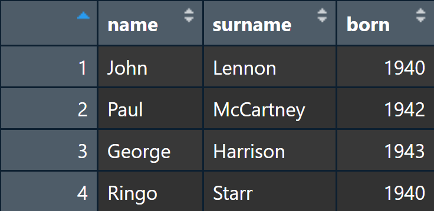

<style>
p.caption {
  font-size: 0.6em;
}
</style>


```{r setup, include=FALSE}
knitr::opts_chunk$set(echo = TRUE,  comment = '', warning = FALSE)
library(tidyverse)
library(vroom)
library(future)
library(furrr)
```

# R Basics

## *R*

-   freie Softwareumgebung
-   flexible Anwendungsmöglichkeiten, u.a. Statistik, Textverarbeitung, Visualisierung, Netzwerkanalyse, API-Zugriff, Webscraping, Interaktive Anwendungen....
-   Zahlreiche Funktionen werden über sogenannte "Packages" bereitgestellt
-   vergleichbar mit *Python*, allerdings mit Wurzeln in der statistischen Analyse - daher ein leicht engerer Fokus, welcher *R* insbesondere in den Sozial- und Politikwissenschaften beliebt macht
-   Ähnlich wie in *Python* werden in *R* **Funktionen** auf **Objekte** angewendet, um diese zu manipulieren


## R als Taschenrechner

```{r}
1 + 4
```

```{r}
(1230 + log(1238) * 5) ^ 2
```

## Objekte

**Zuordnen von Objekten**

```{r}
x <- 2
x
```

```{r}
x + 5
```

## Objekte

**Überschreiben von Objekten**

```{r}
x <- 7
x
```


**Neuzuordnungen**

```{r}
y <- x + 5
y
```

## Objekttypen

```{r}
numerisches_objekt <- 4
numerisches_objekt
```

```{r}
integer_objekt <- 4L
integer_objekt
```

```{r}
logisches_objekt <- TRUE
logisches_objekt
```

## Objekttypen
```{r}
text_objekt <- "ein Objekt voll Text"
text_objekt
```

```{r}
datum <- as.Date("2023-03-10")
datum
```

## Objekttypen ändern

```{r}
z <- "25"
z
is.character(z)
```

## Objekttypen ändern

```{r}
z <- as.numeric(z)
z
is.character(z)
is.numeric(z)
```

## Fehlende Werte: NA

```{r}
missing <- NA
missing
is.na(missing)
```

## Fehlende Werte: NULL

```{r}
is.null(missing)
nothing <- NULL
is.na(nothing)
```

`NULL` bezeichnet undefinierte Werte, welche nicht evaluiert werden können. `NULL` kann kein Teil anderer Datenstrukturen, z.B. Vektoren sein (`NULL` wird bei der Zuordnung ignoriert). `NA` kann hingegen Teil anderer Datenstrukturen sein, um fehlende Werte anzuzeigen. **Fehlende Werte, z.B. fehlende Beobachtungen sollten immer mit `NA` angegeben weden**

## Datenstrukturen I: Vektoren

Vektoren sind Objekte mit mehreren Werten, wobei diese Werte vom selben Typ (numerical, character, etc) sein müssen

```{r}
numbers_vector <- c(1,2,3,8,76,9)
numbers_vector
```

```{r}
numbers_vector[5]
```

```{r}
numbers_vector[5] * 2
```

## Datenstrukturen I: Vektoren

```{r}
numbers_vector * 2
```

```{r}
length(numbers_vector)
```

```{r}
sum(numbers_vector)
```

```{r}
mean(numbers_vector)
```

## Datenstrukturen II: Listen

Listen beinhalten ebenfalls mehrere Werte. Sie können jedoch unterschiedliche Objekttypen und sogar weitere Objekte mit mehreren Objekten, z.B. eine weitere Liste, als Werte enthalten. Auf ihnen kann jedoch, im Unterschied zu Vektoren, nicht direkt operiert werden.

```{r}
my_list <- list(1, 3, 5)
my_list
```

## Datenstrukturen II: Listen

```{r}
my_fancy_list <- list(c(1,2,5), 43, "what a list!", list(TRUE, 42))
my_fancy_list
```

## Datenstrukturen II: Listen

```{r, error=T}
sum(my_list)
```

```{r}
sum(my_fancy_list[[1]])
```

## Datenstrukturen III: Dataframes

Dataframes kombinieren (im Gegensatz zu Listen) **gleich lange** Vektoren unterschiedlichen Typs. Sie sind (grob) vergleichbar mit Tabellen in z.B. Excel

```{r}
beatles_data <- data.frame(
  name = c("John", "Paul", "George", "Ringo"),
  surname = c("Lennon", "McCartney", "Harrison", "Starr"),
  born = c(1940, 1942, 1943, 1940)
)
beatles_data
```

## Datenstrukturen III: Dataframes

```{r, eval = F}
View(beatles_data) # Ansehen des Dataframes im Viewer
```

```{r, echo=FALSE, fig.cap="", out.height="80%", out.width="80%"}

```

## Datenstrukturen III: Dataframes

```{r}
mean(beatles_data$born)
```

```{r}
nrow(beatles_data) # Anzahl Reihen
```

```{r}
length(beatles_data) # Anzahl Spalten
```

```{r}
dim(beatles_data) # Anzahl der Reihen und Anzahl der Spalten
```

## Datenstrukturen III: Dataframes

```{r}
names(beatles_data) # Namen der Spalten
```

```{r}
str(beatles_data) # Struktur des Dataframes
```

# Einführung in das *tidyverse*

## Das Tidyverse

```{r, eval=F}
install.packages("tidyverse") # Installation eines Packages
library(tidyverse) # Laden eines Packages
```

-   Sammlung an Packages, die nach denselben Prinzipien operieren und entsprechend kompatibel sind
-   effiziente und konsistentere Alternative zur Verwendung gängiger R-Basis-Operationen, z.B. zur Datenmanipulation oder Visualisierung
-   **eine** Art, R zu verwenden
-   Häufig finden sich Mischungen des *tidy*-Syntax und des *base*-Syntax

## Das Tidyverse

Das *Tidyverse* beruht auf dem *tidy data*-Prinzip:

```{r, echo=FALSE, fig.cap="https://r4ds.hadley.nz/data-tidy.html#fig-tidy-structure", out.height="100%", out.width="100%"}
knitr::include_graphics("images/tidy-1.png")
```

## Vergleich von *Base R* und *Tidyverse*

**Base R: Multiple Objekte**

*Hinweis: "Iris" ist ein Testdatensatz, welcher in R immer verfügbar ist*

```{r}
data <- iris 
subset <- data[data$Sepal.Length > 7, ]
mean_width <- mean(data$Sepal.Width)
sub_subset <- subset[subset$Sepal.Width > mean_width,]
result <- sum(sub_subset$Petal.Width)
result
```

## Vergleich von *Base R* und *Tidyverse*

**Alternative in Base R: verschachtelte Funktionen**

```{r}
result <- sum(data[data$Sepal.Length > 7 &
                     data$Sepal.Width > mean(data$Sepal.Width), 
                   "Petal.Width"])
result
```

## Vergleich von *Base R* und *Tidyverse*

**Tidyverse: *Pipe* (`%>%`)  **

```{r}
result <- data %>% 
  filter(Sepal.Length > 7) %>% 
  filter(Sepal.Width > mean(Sepal.Width)) %>% 
  pull(Petal.Width) %>% 
  sum()
result
```

## Pipes

- Der Shortcut für das Einsetzen einer *Pipe*  ist *strg+shift+m*
- *R* bietet seit Version 4.1 auch eine eigene *Pipe*, `|>`, welche nicht von dem Tidyverse abhängig ist
- Unter `Tools / Global Options / Code / Editing / Use native pipe operator` lässt sich festlegen, ob der *R*-eigene *Pipe*-Operator verwendet werden soll
- *tidyverse* und base *R* Pipes sind größtenteils identisch in ihrer Verwendung, jedoch bietet `%>%` (noch) einige erweiterte Funktionen - siehe https://www.tidyverse.org/blog/2023/04/base-vs-magrittr-pipe/


## Data Wrangling im Tidyverse:  *dplyr*

Wir wollen die Höchstwerte der Blütenlänge für jede Spezies im *Iris*-Datensatz, wobei nur Exemplare mit überdurchschnittlicher Blütenbreite berücksichtigt werden sollen

```{r}
iris %>% 
  group_by(Species) %>% # Gruppierung 
  filter(Petal.Width > mean(Petal.Width)) %>% # Filterung 
  slice_max(Petal.Length, n = 1) # Höchstwerte 
```

## Data Wrangling im Tidyverse:  *dplyr*

Durschnittliche Blütenbreite pro Spezies

```{r}
iris %>% 
  group_by(Species) %>% 
  summarise(mean_Petal.Width = mean(Petal.Width))
```

## Gotcha: Beständige Gruppierungen

Warum unterscheiden sich die Ergebnisse?

```{r}
grouped <- iris %>% group_by(Species) %>% 
  filter(Petal.Width > mean(Petal.Width))
grouped %>% summarise(n = n())
```

```{r}
iris %>% filter(Petal.Width > mean(Petal.Width)) %>% summarise(n = n())
```


## Gotcha: Beständige Gruppierungen

Lösung: De-gruppieren mit `ungroup()` *oder* mit dem `.by`-Argument nur für einzelne Operationen gruppieren

```{r}
grouped %>% ungroup() %>% summarise(n = n())
```
```{r}
iris %>% filter(Petal.Width > mean(Petal.Width), .by = Species) %>% 
  summarise(n = n())
```
## Gängige Operationen mit *dplyr* I

**Gruppieren** mit `group_by()` oder dem `.by`-Argument

**Filtern** nach Werten mit `filter()`

**Manipulieren** von Variablen mit `mutate()`

**Zusammenfassen** des Datensatzes mit `summarise()`

**Umbenennen** von Variablen mit `rename()`

**Sortieren** nach Variablenwerten mit `arrange()`


## Gängige Operationen mit *dplyr* II

**Auswählen von Variablen** mit `select()`

**Auswählen von Reihen** mit `slice()` (Position), `slice_head()`/`slice_tail()` (erste/letzte Reihen), `slice_min()`/`slice_max()` (höchste/niedrigste Variablenwerte), `slice_sample()`(Zufallsstichprobe)

**Zusammenfügen** unterschiedlicher Datensätze mit SQL-like *joins*: `inner_join()`, `left_join()`, `right_join()`, `full_join()`

Siehe auch: https://dplyr.tidyverse.org/articles/dplyr.html


## Visualisierung mit dem Tidyverse: *ggplot2*

ggplot verwendet `+` statt der Pipe `%>%` 

```{r, eval=F}
ggplot(iris,
       # festlegen der Variablen mit aes()
       aes(x = Petal.Length, y = Petal.Width, color = Species)) + 
  # festlegen des Plot Typs. Hier: Linie
  geom_line() + 
  # Optional: Verwendung eines anderen Farbthemas 
  theme_bw() + 
  # Optional: manuelle Beschriftung
  labs(
    x = "Blütenblattlänge",
    y = "Blütenblattbreite",
    color = "Gattung",
    title = "Blütenlänge- und Breite nach Gattung"
  ) 
```

## Visualisierung mit dem Tidyverse: *ggplot2*

```{r, echo=F}
ggplot(iris,
       # festlegen der Variablen mit aes()
       aes(x = Petal.Length, y = Petal.Width, color = Species)) + 
  # festlegen des Plot Typs. Hier: Linie
  geom_line() + 
  # Optional: Verwendung eines anderen Farbthemas (für den Hintergrund etc.)
  theme_bw() + 
  # Optional: manuelle Beschriftung
  labs(
    x = "Blütenblattlänge",
    y = "Blütenblattbreite",
    color = "Gattung",
    title = "Blütenlänge- und Breite nach Gattung"
  )
```


## Übungen

Übungen zum Tidyverse unter https://github.com/TimBMK/r-server-workshop/blob/main/Exercices_basic.Rmd

Alle Workshopmaterialien können via Git in euren Ordner auf dem Server kopiert werden. Dazu folgenden Code im **Terminal** (nicht der R-Console!) eingeben:
```{r, eval = F}
git clone git@github.com:TimBMK/r-server-workshop.git
```


## Addendum: Was tun, wenn unser Code nicht funktioniert?

-   Fehlermeldung suchen auf Google, Duckduckgo...
-   Nach dem Problem auf <https://stackoverflow.com/> **suchen** oder nach der Lösung **fragen**
-   Die Seite des Packages aufsuchen: idR. auf github.com - dort unter "Issues" suchen oder fragen, z.B. <https://github.com/tidyverse/dplyr/issues>
-   LLMs wie ChatGPT *können* Lösungen bieten - aber diese sind nicht immer korrekt (v.a. bei komplexen Problemen)!
-   `?function` oder `help(function)`, z.B. `?summarise`, öffnet die Hifeseite einer Funktion in RStudio


# Kontrollstrukturen

## Kontrollstrukturen I: For-Loops

```{r}
for (row in 1:nrow(beatles_data)){
  print(paste(beatles_data$name[row], 
              beatles_data$surname[row], 
              "was born in", 
              beatles_data$born[row]))
}
```

## Kontrollstrukturen I: For-Loops

- iterieren durch alle Elemente eines Objekts (z.B. durch alle Reihen eines Dataframes)
- flexibel
- deutlich langsamer als andere Methoden
- **Nie für die Erweiterung von Objekten verwenden** (extrem langsam aufgrund von Speicherreallokation)
- **Nur in Ausnahmefällen verwenden**, z.B. printouts oder beim iterieren über mehrere getrennte Objekte

## Kontrollstrukturen II: Apply-Funktionen

```{r}
# Was ist die Anzahl der Zeichen in jeder Reihe und Spalte?
apply(beatles_data, 2, nchar) 
```

## Kontrollstrukturen II: Apply-Funktionen

- schneller als For-Loops, insb. durch optimierte Speicherallokation
- Familie an Funktionen, mit optimierten shorthands für unterschiedliche Datentypen: `lapply()` (List), `sapply()` (Vector/Array), `vapply()` (Vector)
- Anwendung u.U. komplex, insb. durch variierende Ausgabeformate
- nicht immer die schnellste Lösung


## Kontrollstrukturen III: Vektorisierte Funktionen

```{r}
2024 - beatles_data$born
```

## Kontrollstrukturen III: Vektorisierte Funktionen

- viele Basisfunktionen sind vektorisiert (+, -, etc.)
- arbeiten ohne explizite Kontrollfunktionen auf dem gesamten Objekt
- sehr schnell, Implementation häufig in C
- **viele tidyverse-Funktionen sind vektorisiert** (z.B. zur Datenmanipulation)
- nicht alle Probleme mit den gegebenen Funktionen lösbar


## Kontrollstrukturen IV: Map-Funktionen

Zwei unterschiedliche Schreibweisen (Ergebnis ist identisch):

```{r, eval = F}
map(beatles_data, nchar)
```
```{r}
beatles_data %>% map(\(var) nchar(var))
```


## Kontrollstrukturen IV: Map-Funktionen

- Teil des *tidyverse* (purrr)
- sehr flexibel
- vergleichbar mit apply-Funktionen, allerdings vereinheitlichter Output
- Familie an Funktionen, optimiert für unterschiedlichen Output: `map()` (List), `map_lgl()` (Logical), `map_int()` (Integer), `map_dbl()` (Numerical), `map_chr()` (Character), `map_vec()`(Vektorentypen wie Daten, Faktoren etc.)
- erweitert durch die `walk()`-Funktion, um `map()` ohne Rückgabe auszuführen (z.B. für printouts oder abspeichern von Daten)
- idR. nicht so schnell wie vektorisierte Funktionen
- mit dem *future*-Framework parallelisierbar


## Benchmarks

```{r, echo = F}

library(microbenchmark)

set.seed(42)  # Reproduzierbarkeit
n <- 10000  # Anzahl der Reihen
example_data <- data.frame(
  id = 1:n,
  value = runif(n, min = 1, max = 100)  # Zufallszahlen zwischen 1 und 100
)

# Funktionen, welche die Zahlenwerte verdoppeln

double_with_loop <- function(data) {
  result <- data
  for (i in seq_along(result$value)) {
    result$value[i] <- result$value[i] * 2
  }
  return(result)
}

double_with_apply <- function(data) {
  result <- data
  result$value <- sapply(result$value, function(x) x * 2)
  return(result)
}

double_with_map <- function(data) {
  result <- data
  result$value <- map_dbl(result$value, ~ .x * 2)
  return(result)
}

double_with_dplyr <- function(data) {
  result <- data %>%
    mutate(value = value * 2)
  return(result)
}

# Vergleich der Methoden
benchmark_results <- microbenchmark(
  For_Loop = double_with_loop(example_data),
  Apply = double_with_apply(example_data),
  Map = double_with_map(example_data),
  Dplyr = double_with_dplyr(example_data),
  times = 3  # Anzahl der Wiederholungen
)
```

```{r, echo = F}
autoplot(benchmark_results) +
  labs(title = "Performance-Vergleich: For-Loop vs Apply vs Map vs Dplyr",
       subtitle = "Simple Funktion, welche Zahlenwerte in einem Datensatz mit 10.000 Reihen verdoppelt") +
  theme_minimal()
```

## Takeaway: Best practices

- Wenn möglich vektorisierte Funktionen verwenden
- bei komplexeren Operationen entweder `apply()` oder `map()` verwenden
- `map()` ist flexibler und Teil des *tidyverse* 
- for-Loops nur in Ausnahmefällen verwenden, da diese idR. sehr langsam sind

# Effiziente Verarbeitung großer Datenmengen

## Einlesen großer Datenmengen: *vroom*

- 1.23GB/sec read-in (!)
- lazy load: Daten werden indiziert, aber erst bei Bedarf geladen
- keine Änderungen im Code nötig, nur sehr geringe Verlangsamung von Operationen
- Multithreading (automatische Parallelisierung beim lesen und schreiben)

```{r, echo=FALSE, fig.cap="https://vroom.r-lib.org/; siehe auch: https://vroom.r-lib.org/articles/benchmarks.html", out.height="70%", out.width="70%"}

```


## vroom

```{r, eval = F}
library(vroom)
```


```{r}
party_comments_january <- vroom("data/party_comments_january.csv")
```

## vroom

- liest `.csv` und verwandte Formate (z.B. `.tsv`) ein, delimiter kann mit dem `delim`-Argument angepasst werden ("," / ";" / "\\t" / "|"...)
- kann mehrere Files auf einmal einlesen (z.B. ganze Ordner) -  solange die Spalten übereinstimmen
- kann beim einlesen bereits Spalten auswählen (`col_select`-Argument) - und unterstützt dabei Hilfsfunktionen wie `starts_with()`
- nicht direkt Teil des *tidyverse*, aber in Handhabe und Syntax sehr ähnlich

## vroom
- kann ebenso Daten exportieren, indem Datensätze aus *R* als `.csv` (o.ä.) abgespeichert werden: `vroom_write()`
- beim einlesen und schreiben großer Datenmengen *sehr* viel schneller als die Verwendung der *R*-eigenen Formate `.RDS` oder `.RDA`
- Aber: **Nicht alle Objekte lassen sich im `.csv`-Format abspeichern!**


## vroom

**Problem:** .csv und ähnliche Datentypen können für große Datenmengen *sehr* groß werden

**Lösung:** Komprimieren, z.B. als `.gz`, `.zip`

- *vroom* unterstützt das einlesen **und** speichern komprimierter Dateien - ohne weiteren Aufwand!
- untersützt unterschiedliche Backends via `pipe()`-Funktion, z.B. um mit *pigz* noch schneller große Mengen komprimierter Daten zu schreiben

## vroom
```{r, eval = F}
vroom_write(party_comments_january, 
            "data/party_comments_january.csv.gz")

vroom_write(party_comments_january, 
            pipe("pigz > data/party_comments_january.csv.gz"))

party_comments_january <- vroom("data/party_comments_january.csv.gz")
```

Größenunterschiede:
```{r, echo = F}
cat(paste0("party_comments_january.csv", ": ", file.size("data/party_comments_january.csv")/1e6, "mb\n"))
cat(paste0("party_comments_january.csv.gz", ": ", file.size("data/party_comments_january.csv.gz")/1e6, "mb"))
```


**Große Datensätze sollten immer komprimiert, z.B. als `.csv.gz`, gespeichert werden!**


## Gotcha: Spaltentypen

Im Unterschied zu den `.RDS` und `.RDA`-Formaten liefern `.csv` und verwandte Formate keine Informationen zu den Datentypen in einer Spalte.
*vroom* (und vergleichbare Funktionen im Tidyverse) versuchen daher, den Datentyp einer Spalte zu erraten. Das funktioniert häufig und kann mit dem
`guess_max`-Argument noch verbessert werden, indem die Anzahl Reihen, welche zum raten herangezogen werden, erhöht wird (praktisch, wenn z.B. viele 
Reihen in einer Spalte fehlende Daten haben). 

```{r, eval = F}
party_comments_january <- vroom("data/party_comments_january.csv", 
                                guess_max = 10000)
```


## Gotcha: Spaltentypen

Trotzdem kann es sinnvoll sein, die Spaltentypen händisch zu spezifizieren. Insbesondere **lange numerische IDs**, welche sonst u.U. automatisch als 
numerischer Datentyp eingelesen und von *R* gerundet werden (z.B. Tweet IDs), sollten als `character` eingelesen werden - sonst kann es zu Rundungsfehlern 
dazu kommen, dass IDs nicht mehr mit den ursprünglichen Daten übereinstimmen!

```{r, eval = F}
party_comments_january <- vroom("data/party_comments_january.csv",
                                col_types = list(video_id = "c",   
                                                 comment_id = "c"))
```

**IDs immer als character strings einlesen!**


## Noch schneller: *data.table*

*dplyr* ist schnell in der Verarbeitung von Daten, kann aber auch an Grenzen stoßen. Das *data.table* Package bietet hier eine Alternative:

- sehr schnell in der Manipulation von Daten
- eigene, ebenfalls sehr schnelle Funktionen zum einlesen von Daten
- idr. Speichereffizient


## Noch schneller: *data.table*

Aber:

- eigene, teils komplizierte Syntax - für einige Operationen müssen z.B. *keys* händisch gesetzt werden
- Operationslogik weicht vom *tidyverse* ab, pipes (%>%) sind bspws. kein Teil von *data.table*

Das *tidyverse* ist insgesamt zugänglicher als *data.table*. Für die Verarbeitung extrem großer Datenmengen oder häufig verwendete Operationen
(z.B. in eigenen Funktionen) kann *data.table* jedoch die bessere Alternative darstellen.

https://cran.r-project.org/web/packages/data.table/vignettes/datatable-intro.html


## Parallelisierung 

Wenn komplexe Operationen ausgeführt werden, kann es sinnvoll sein, diese zu parallelisieren, um den Prozess zu beschleunigen:

- Parallelisierung ermöglicht die simultane Ausführung von Operationen auf einem System
- idR. geschieht dies über die asynchrone Evaluation von Operationen in ausgelagerten Prozessen (multithreading)
- für einige Packages und Funktionen ist Parallelisierung bereits nativ implementiert (z.B. *vroom*), ihre Zahl nimmt tendenziell zu
- Parallelisierung birgt Risiken und Kosten, da die verwendeten Daten idR. in die Subprozesse kopiert werden müssen - **eine schlechte Parallelisierung ist häufig langsamer und ressourcenaufwändiger als eine normale (sequenzielle) Verarbeitung!**


## Das *future* Framework

Das *future* Package bietet die Möglichkeit, Operationen asynchron, d.h. über mehrere Prozesse verteilt, auszuführen. Es verwendet dazu den `%<-%` Operator und `{}`.

Dies ist z.B. sinnvoll wenn:

- Mehrere rechenintensive Prozesse **unabhängig voneinander** ausgeführt werden sollen
- Häufig ausgeführte, zeitkritische Prozesse optimiert werden sollen
- Rechenleistung nur über dezentrale Cluster zur Verfügung steht, d.h. eine Operation über mehrere Rechner veteilt werden muss


## Das *future* Framework

Es muss bedacht werden dass:

- Die Ergebnisse einer Operation den anderen parallel ausgeführten Operationen **nicht** zur Verfügung stehen
- Die Parallelisierung einen Overhead besitzt, da die notwendigen Daten in die Subprozesse kopiert werden müssen - dieser Overhead kann größer sein als der Gewinn!


## Das *future* Framework

Ein arbiträres Beispiel (bei dem die Parallelisierung keine Gewinne bringen würde):
```{r}
most_video_comment_likes %<-% {
  party_comments_january %>% 
    summarise(likes = sum(likeCount), .by = video_id)
}

most_party_comment_likes %<-% {
  party_comments_january %>% 
    summarise(likes = sum(likeCount), .by = party_label)
}
```


## Das *future* Framework

**Wichtig:** Das Ergebnis wird erst dann aus dem Subprozess zurückgeholt, wenn es aufgerufen wird. D.h. wir sehen Fehlermeldungen erst, wenn wir das Ergebnis brauchen!

```{r}
error %<-% {
  nonexistent_object %>% 
    summarise(likes = sum(likeCount), .by = video_id)
}
```

Keine Fehlermeldung beim ausführen der *future*

```{r, error=TRUE}
error
```


## Das *future* Framework

Das *future* Framework bietet unterschiedliche Parallelisierungsstrategien: 

- *sequential*: sequenzielle Ausführung, d.h. keine Parallelisierung
- *multisession*: im Hintergrund laufende *R*-Sessions
- *multicore*: "echte" Parallelisierung über geforkte *R*-Prozesse - diese Option steht unter Windows und in RStudio **nicht** zur Verfügung!
- *cluster*: externe *R*-Sessions - idR. nur für dezentral verteilte Rechencluster sinnvoll


## Das *future* Framework

Die Parallelisierungsstrategie wird **für den gesamten in dieser Session ausgeführten Code** mittels `plan()` festgelegt. Dort wird ebenfalls die Anzahl verwendeter Threads mittels dem `workers`-Argument festgelegt.

```{r, eval=F}
library(future)

plan(multisession, workers = 8)
```

**In RStudio sollte für die Parallelisierung eine *multisession* verwendet werden!**

Wenn der Code direkt via Shell auf dem Server ausgeführt wird wird, z.B. mittels `rscript`, ist die Verwendung von *multicore* sinnvoll.


## Das *future* Framework

Der folgende Code prüft, ob es sich in der aktuellen Session im eine RStudio-Session handelt und legt die Parallelisierung entsprechend auf *multisession* oder *multicore* fest. Außerdem legt er die Anzahl der verwendeten Threads auf die Hälfte der verfügbaren Threads fest.

```{r}

workers <- availableCores()/2

  if (installr::is.RStudio()){ # Multisession for R Studio Sessions
    plan(multisession, workers = workers) 
  } else { # multicore for scripts / non-rstudio processes
    plan(multicore, workers = workers)
  }

```

**Der DSL-Server verfügt über 16 Kerne mit insgesamt 32 Threads. Eine Parallelisierung sollte NIEMALS mehr als 16 Threads beanspruchen!**


## Das *future* Framework

**Nachdem die parallelisierten Operationen ausgeführt wurden, sollte die Multisession beendet werden, um Ressourcen zu sparen**

Dazu wird der "Plan" wieder auf sequenziell gesetzt.

```{r}
plan(sequential)
```

**Wichtig**: Die Ergebnisse der Subprozesse müssen vorher evauliert (d.i. in die eigentliche R-Umgebung zurückgeholt) werden - sonst gehen sie gemeinsam mit den Subprozessen verloren!


## Das *future* Framework

```{r, eval = F}
workers <- availableCores()/2
  if (installr::is.RStudio()){ # Multisession for R Studio Sessions
    plan(multisession, workers = workers) 
  } else { # multicore for scripts / non-rstudio processes
    plan(multicore, workers = workers)
  }
most_video_comment_likes %<-% {
  party_comments_january %>% 
    summarise(likes = sum(likeCount), .by = video_id)
}
most_party_comment_likes %<-% {
  party_comments_january %>% 
    summarise(likes = sum(likeCount), .by = party_label)
}
most_video_comment_likes %>% pull(likes) %>% mean()
most_party_comment_likes %>% pull(likes) %>% mean()
plan(sequential)
```


## Das *future* Framework

Das package *furrr* bietet die Möglichkeit, die Map-Funktionen aus *purrr* mit dem *future*-Framework zu parallelisieren

- Die Parallelisierung wird wie bei *future* mittels `plan()` festgelegt
- Die Funktionen entsprechen den Map-Funktionen von *purrr*, mit dem Zusatz `future_`: `future_map()`, `future_map_int()`,`future_walk()` etc.


## Das *future* Framework

*furr*

- Es gibt eine Reihe an Gotchas, u.a. sollte ein Seed für die Generierung von Zufallszahlen mit dem Argument `.options = furrr_options(seed = 123)` festelegt werden (wichtig bei zufälligen Initialisierungen), Dataframes sollten nicht gruppiert sein (Performance!) und die Evaluation von Argumenten operiert leicht anders - siehe: https://furrr.futureverse.org/articles/gotchas.html
- Die Daten für jeden parallelisierten map-Prozess müssen auf den Subprozess übertragen werden. Um eine ineffiziente Verwendung zu vermeiden, ist die Maximalgröße der übetragbaren Daten limitiert. Diese kann mit `options(future.globals.maxSize)` überschrieben werden. Das sollte jedoch **nur in Ausnahmefällen** passieren!


## Das *future* Framework

Beispiel: Durchschnittliche Zeichenanzahl pro Variable

```{r}

plan(multisession, workers = 2)

party_comments_january %>% 
  ungroup() %>% # ungroup just in case
  future_map_dbl(\(var) {nchar(var) %>% mean(na.rm = TRUE)})

plan(sequential)

```


## Verarbeitung *sehr* großer Datenmengen: Datenbanksysteme

Da *R* Daten idR. in den RAM lädt, kann es - je nach System - zu Problemen kommen, wenn für sehr große Datensätze nicht genug RAM zur Verfügung steht.
Eine Alternative stellen Datenbanksysteme dar, welche entweder lokal oder in einer Cloud aufgesetzt werden und nur mit *R* kommunizieren.


## Verarbeitung *sehr* großer Datenmengen: Datenbanksysteme
- Daten werden nicht direkt in *R* geladen, sondern über SQL o.ä. nur abgerufen
- Für große Datenmengen häufig performanter und vermeidet RAM Bottlenecks
- Jedoch kann sich die Verarbeitung der Daten in *R* kompliziert gestalten, da Operationen u.U. angepasst werden müssen
- Es sollte **gründlich** geprüft werden, ob der Einsatz von Datenbanksystemen nötig ist - oder ob mit anderen Tools (z.B. *vroom* oder *data.table*) nicht eine einfachere Optimierung möglich ist
- Mögliche Systeme sind z.B. DuckDB, welche lokale und Cloud-basierte Lösungen anbietet und mit *duckplyr* eine *tidyverse* Implementation bietet (https://duckdb.org/2024/04/02/duckplyr.html); *RSQLite*, welches SQL-Funktionen implementiert; oder *RPostgres*, welches Postgres-Implementationen bietet
