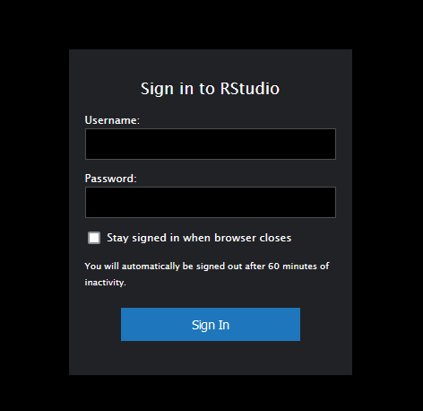
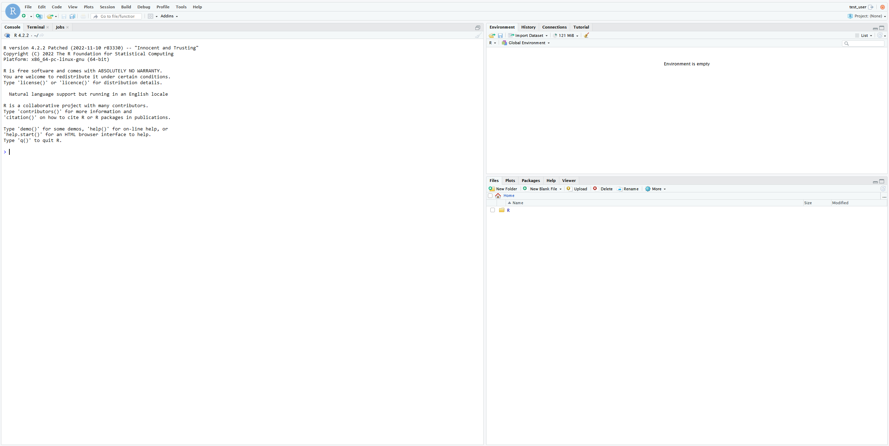
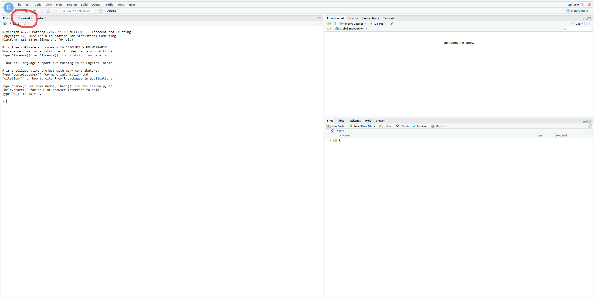
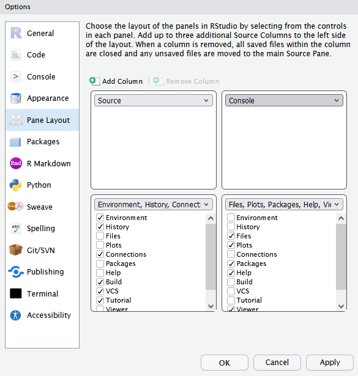
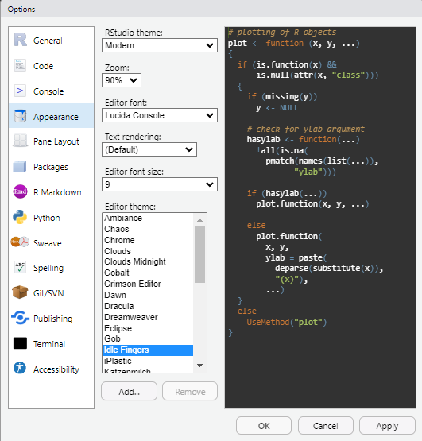
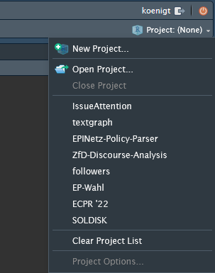
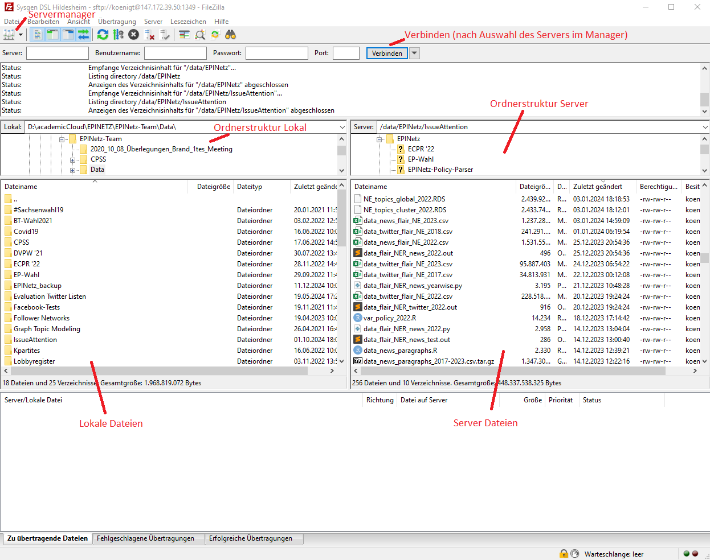
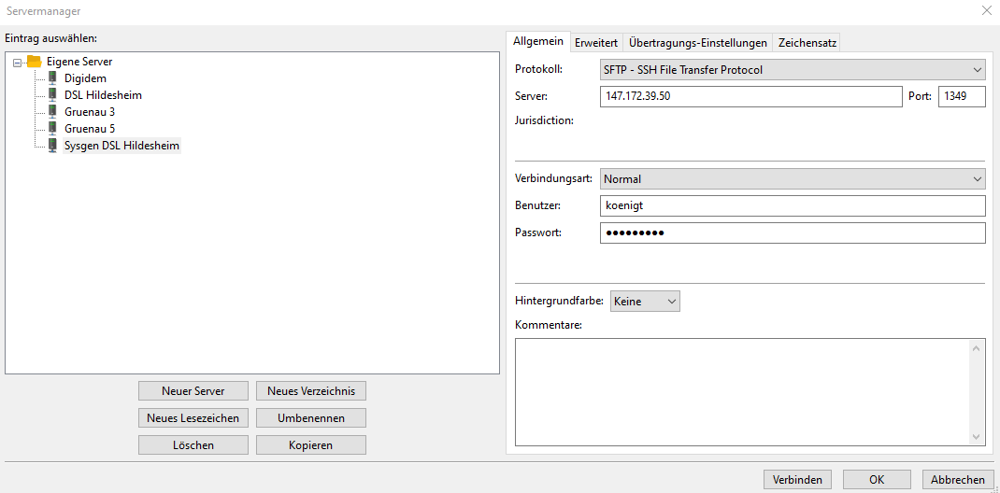
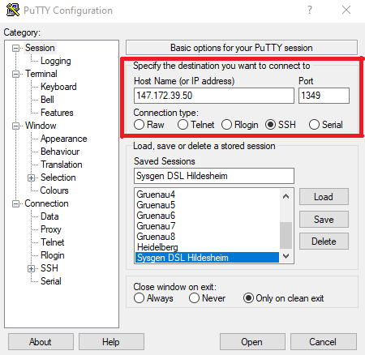
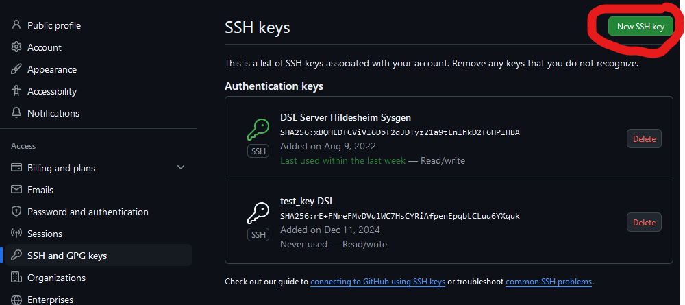

<style>
p.caption {
  font-size: 0.6em;
}
</style>


```{r setup, include=FALSE}
knitr::opts_chunk$set(echo = TRUE,  comment = '', warning = FALSE)
```

# Der DSL-Server

## Hardware

- AMD Threadripper Pro, 16 Kerne / 32 Threads, 3,9gHz
- 256gb DDR4 RAM
- 3,84TB Festplattenspeicher
- **keine** GPUs (noch?)
- bisher vor allem im EPINetz-Projekt verwendet


## Zugriff

- Zugriff wird derzeit nach Bedarf händisch von Admins gewährt: Tim König; Franziska Ziegler (Vertretung)
- Zugriff derzeit auf Forschende beschränkt, Öffnung für Lehre denkbar
- Zugriff benötigt universitätsinternes Netzwerk, entweder aus lokalem Netz oder via VPN (https://www.uni-hildesheim.de/rz/uni-vpn/)
- Standard Ports sind geschlossen
- Admins sind in Absprache mit dem RZ für die Sicherheit des Servers zuständig. Sie können notfalls Prozesse abbrechen etc. 
- Bei Problemen, Fragen oder Bedarfen (z.B. Installation von Programmen) an die Admins wenden!


## Zugriffsarten

- RStudio Server (R, Python, Terminal)
- PuTTY (Terminal)
- Filezilla (Datenzugriff)
- weitere Zugriffsarten (Jupyter notebooks, VS Code Integration...) ggf. bei Bedarf möglich


# RStudio Server

## R Studio
-   IDE (*Integrated Development Environment*), ermöglicht u.a. komfortables anlegen von Scripts, Inspektion von Objekten, Öffnen von Help-Files sowie das Anzeigen von Grafiken und Graphen
-   Neben *R* auch Unterstützung von *Python* via *reticulate*. Siehe: https://rstudio.github.io/reticulate/. Python v3.8.10 ist installiert
-   **RMarkdown** ermöglicht das komfortable anlegen von Dokumentationen, Berichten oder Präsentation (wie dieser hier), die auf R-Code basieren
-   Integrierter **Terminal** bietet Zugriff auf einen vollumfänglichen Linux Terminal


## RStudio Server Zugriff
-   Der Zugriff auf RStudio auf dem Server erfolgt bequem **über den Browser*. Einfach http://147.172.39.50:8787/ in das Adressfeld eingeben
-   Der Login erfolgt über den Account auf dem Server. Benutzername ist idR. die RZ-Kennung, welche auch in der Mailadresse angegeben ist (z.B.koenigt)
-   Beim ersten Zugriff: **Passwort ändern!** Default-Passwort: *changethispasswordnow*
-   Eine lokale *R* Installation ist **nicht** nötig
-   Die gesamten Rechenkapazitäten des Servers stehen über RStudio Server zur Verfügung. Alle ausgeführten Operationen laufen auf dem Server


## RStudio Server: Erster Zugriff

```{r, echo=FALSE, fig.cap="http://147.172.39.50:8787/", out.height="50%", out.width="50%"}

```

## RStudio Server: Erster Zugriff

```{r, echo=FALSE, out.height="100%", out.width="100%"}

```

## RStudio Server: Passwort ändern

```{r, echo=FALSE, out.height="100%", out.width="100%"}

```

## RStudio Server: Passwort ändern

Im Terminal eingeben:
```{r, eval = F}
passwd
```

Dann erst das alte, dann das neue Passwort eingeben


## RStudio anpassen
```{r, echo=FALSE, out.height="60%", out.width="60%"}

```

## RStudio anpassen
```{r, echo=FALSE, out.height="60%", out.width="60%"}

```

## RStudio anpassen
```{r, echo=FALSE, out.height="60%", out.width="60%"}

```


## Nutzung von RSTudio Server

- **Sessions laufen auch bei Logout weiter**, d.h. man kann längeren Code ausführen lassen und sich bedenkenlos (auch aus dem VPN) ausloggen und später prüfen, ob dieser durchgelaufen ist. Zum Beenden der Session "Quit the current R Session" oben rechts betätigen - dann wird R beendet
- **Keine geteilte Package Library:** Packages müssen von jedem User selbst installiert werden und liegen im R Ordner des Home directories
- **Eigene Projekte** sollten mitsamt allen relevanten Daten im eigenen Home Ordner (Standard Working Directory in Rstudio nach dem Schema data/username) abgelegt werden

## Nutzung von RSTudio Server

- **Best Practice:** Projektstruktur von RStudio nutzen für unterschiedliche Analysen/Projekte nutzen - oben rechts in der Ecke - und diese in je einem eigenen Ordner im Home Directory ablegen

```{r, echo=FALSE, out.height="35%", out.width="35%"}

```

## Nutzung von RSTudio Server
- **Gemeinsame Projekte** können in geteilten Ordnern abgelegt werden. Bei Bedarf bitte bei den Admins melden!
- Um auf Ordner außerhalb des eigenen Home Directories zuzugreifen, braucht es das /data-Suffix. z.B. `setwd("/data/EPINetz")`
- Die open source Version von RStudio Server erlaubt keine Konfiguration der Ressourcennutzung für R / Python. Das heißt: **Achtet bitte eigenständig auf eine vertretbare Ressourcennutzung!**


# Datentransfer

## FileZilla
- Kostenfreies Open Source Programm
- Ermöglicht die komfortable Übertragung von Daten via SSH
- Download unter https://filezilla-project.org/

## FileZilla
```{r, echo=FALSE, out.height="80%", out.width="80%"}

```

## FileZilla
Konfiguration des Servers im Server Manager

```{r, echo=FALSE, out.height="80%", out.width="80%"}

```


# Weitere Anwendungsszenarien

## Aufrufen von R Skripten aus dem Terminal
- Mit dem Befehl `Rscript` können R Skripte direkt aus dem Terminal aufgerufen werden
- Nur eine RStudio Session pro User - direkt aufgerufene Skripte sind davon nicht betroffen (d.h. sie "blockieren" die Session nicht)
- Ein direkter Skript Aufruf kann insb. bei rechenintensiven/langwierigen Operationen sinnvoll sein
- `Rscript` kann mittels `nice`-Value eine Priorität in der Ressourcenallokation zugewiesen werden

## Aufrufen von R Skripten aus dem Terminal
**R Skripte müssen vollständig und in sich abgeschlossen sein** 

- Objekte werden nur gespeichert, wenn dies explizit mit `save()`/`vroom_write()`/etc. geschieht. Dies gilt auch für erstellte Graphen, welche z.B. mit `ggsave()` gespeichert werden können
- alle nötigen libraries müssen installiert sein und im Skript geladen werden 
- Pfade für Objekte müssen korrekt definiert sein, z.B. muss das working directory entsprechend gesetzt werden (`setwd()`)
- Fehlermeldungen brechen das gesamte Skript ab


## Aufrufen von R Skripten aus dem Terminal
- Mit `Rscript` aufgerufene Skripte müssen mit `nohup` und `&` von der aktuellen Terminal-Session getrennt werden - sonst bricht das Skript beim schließen des Terminals ab!
- Output des Skripts wird nur gespeichert, wenn dieser mit `> logname.out` umgeleitet wird. Ansonsten werden keine Fehlermeldungen aus dem Skript angezeigt!
- Es sollte ein `nice`-Value gesetzt werden (je höher dieser ist, desto niedriger die Priorität bei der Ressourcenverteilung)

## Aufrufen von R Skripten aus dem Terminal
Beispiel: Das Skript "myfirstscript.R" wird mit einem nice value von 19 (niedrige Priorität) ausgeführt und schreibt den output der R Session (z.B. Fehlermeldungen) in die Datei "scriptlog.out". Nach ausführen des Befehls kann der Terminal geschlossen werden, das Skript läuft einfach weiter.

```{r, eval = F}
nohup nice -19 Rscript 'myfirstscript.R' > 'scriptlog.out' &
```

*Hinweis:* der Pfad zu dem aufgerufenen Skript ist relativ. Liegt dieses also bspws. in dem Unterordner `myproject`, müsste der Pfad angepasst werden auf `myproject/myfirstscript.R`. Wenn sich die Datei in einem anderen Ordner befindet als dem gerade im Terminal ausgewählten (idR. das Home Directory) kann auch ein absoluter Pfad angegben werden, z.B. `/data/MyHomeDirectory/myproject/myfirstscript.R`.

## Python Skripte

Analog können auch Python Skripte aufgerufen werden. Dazu wird der Befehl `python3` verwendet, z.B.

```{r, eval = F}
nohup nice -19 python3 'myfirstscript.py' > 'scriptlog.out' &
```


## Crontab
- Automatisierung von regelmäßig abgerufenen Skripten (z.B. Web Scrapes)
- Kann *jeden* Befehl automatisieren, indem es ihn zu einer festgelegten Zeit ausführt, z.B. `Rscript`, `python3`, aber auch backups o.ä.
- Aufruf mit `crontab -e`, womit der File mit allen *cronjobs* (regelmäßig ausgeführten Befehlen) eines Users aufgerufen wird
- Diesen File editieren, um ein Skript zu einem festgelegten Zeitpunkt regelmäßig auszuführen
- Siehe z.B. https://linuxhandbook.com/crontab/ für eine Einführung
- Crontab nutzt standardmäßig den *vim* Editor, welcher etwas anders funktioniert als gewohnte Editoren. Siehe z.B. https://www.freecodecamp.org/news/vim-beginners-guide/


## Zugriff über PuTTY

- für fortgeschrittene Nutzer:innen
- bietet direkten Terminal-Zugriff ohne RSTudio Overhead
- Zugriff nur aus dem Uni-Netzwerk (VPN oder vor Ort)

```{r, echo=FALSE, out.height="45%", out.width="45%"}

```


# Github

## Zugriff einrichten

- Zugriff erfolgt über SSH
- Siehe auch: https://docs.github.com/en/authentication/connecting-to-github-with-ssh/generating-a-new-ssh-key-and-adding-it-to-the-ssh-agent und https://docs.github.com/en/authentication/connecting-to-github-with-ssh/adding-a-new-ssh-key-to-your-github-account
- Benötigt einen Github Account!

## Zugriff einrichten

Im **Terminal** (nicht der *R* Console!):

**SSH-Key generieren** (Emailadresse mit der Github-assoziierten ersetzen). Dadurch wird ein SSH-Key generiert, idR. im user home directory (anpassbar). Passphrase optional, muss dann bei jeder Key-Verwendung eingegeben werden.
```{r, eval = F}
ssh-keygen -t ed25519 -C "your_email@example.com"
```

Der Pfad des generierten Keys wird ausgegeben:

`Your identification has been saved in ...`


## Zugriff einrichten

**Privilegien für den .ssh Ordner anpassen**, so dass nur der Besitzer Zugriff auf die Keys hat (sonst später Fehlermeldung!). Wenn der `.ssh` Ordner nicht im aktuellen working directory ist, den Pfad entsprechend anpassen
```{r, eval = F}
chmod -R 700 .ssh
```

**SSH-Agent aktivieren:**
```{r, eval = F}
eval $(ssh-agent)
```

**Key hinzufügen.** Der Pfad des Keys wurde oben ausgegeben (`Your identification has been saved in ...`). Standardmäßig:
```{r, eval = F}
ssh-add .ssh/id_ed25519
```


## Zugriff einrichten

```{r, eval = F}
cat .ssh/id_ed25519.pub
```

Public Key ausgeben lassen und Ergebnis aus dem Terminal **kopieren** (markieren, Rechtsklick, kopieren). Dann auf https://github.com/settings/keys einen neuen SSH-Key erstellen, den kopierten Key unter "Key" einfügen und benennen. Fertig!

```{r, echo=FALSE, out.height="80%", out.width="80%"}

```


## Merkzettel Servernutzung

Ein **Merkzettel** zur Nutzung des Servers findet sich unter https://sync.academiccloud.de/index.php/s/Oo7bjZk7SvXbvMM

(Und wird im Nachgang des Workshops versendet)

